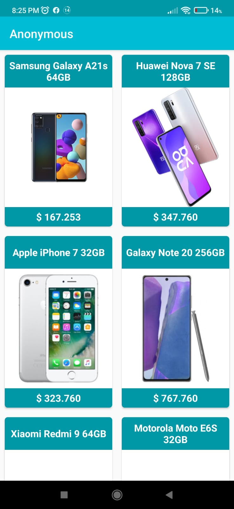
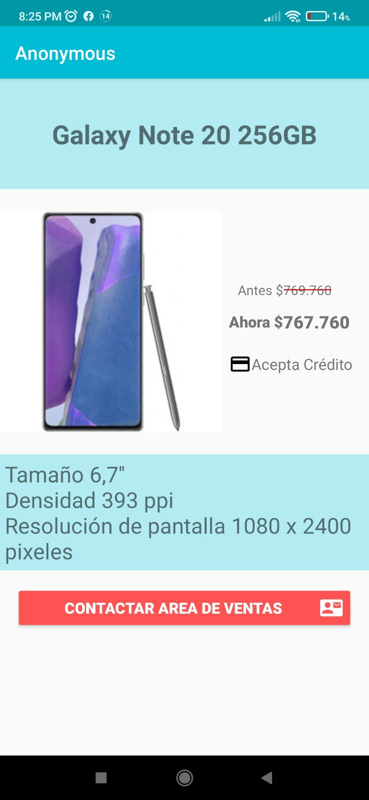

# Anonymous

## Capturas de pantalla
 

# Descripción
La empresa distribuidora de equipos móviles “Anonymous” necesita realizar una aplicación móvil Android. En esta primera instancia
necesitan un mínimo producto viable, donde sus usuarios pueda observar un listado de teléfonos y seleccionar alguno.

## Funcionamiento
- La aplicación inicia en la pantalla de RecyclerView con el listado de celulares cargadas desde el API.
- Al realizar click en un celular, esta muestra su información detallada.
- Al Hacer click boton Contactar al area de ventas se despliega una pantalla donde se podra enviar un correo inmediatamente.

## Dependencia utilizadas

- [Retrofit](https://square.github.io/retrofit/) - Consumo de API
- [Room](https://developer.android.com/jetpack/androidx/releases/room) - Acceso a base de datos
- [Coil](https://coil-kt.github.io/coil/) - Para el manejo de imágenes


## API utilizada en el proyecto
```bash
https://my-json-server.typicode.com/Himuravidal/FakeAPIdata/
```

  

